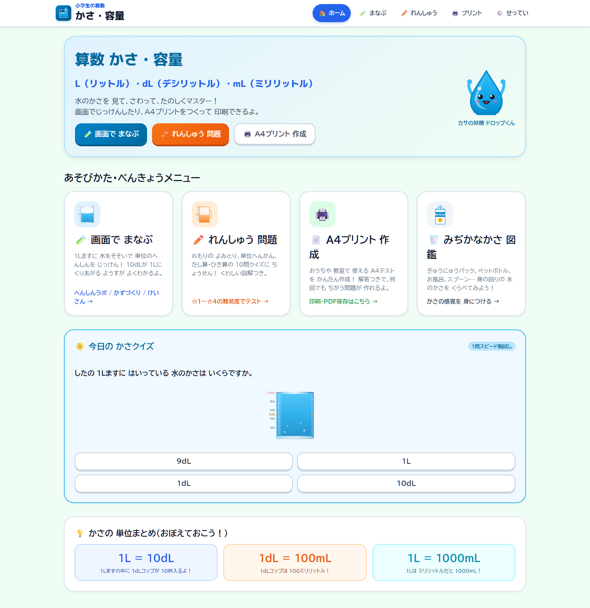
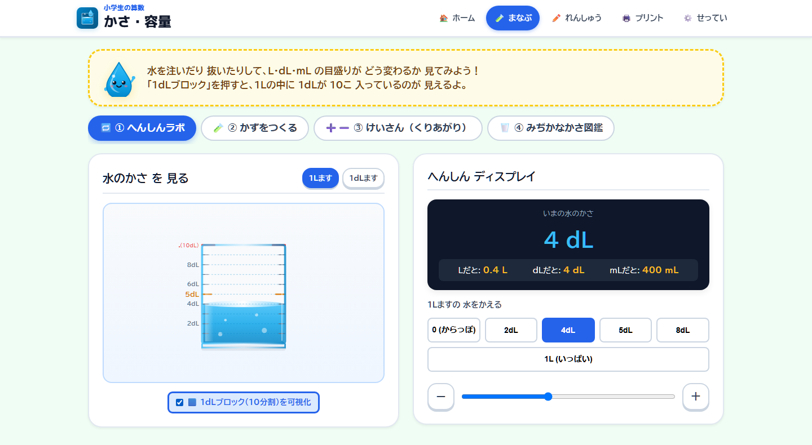
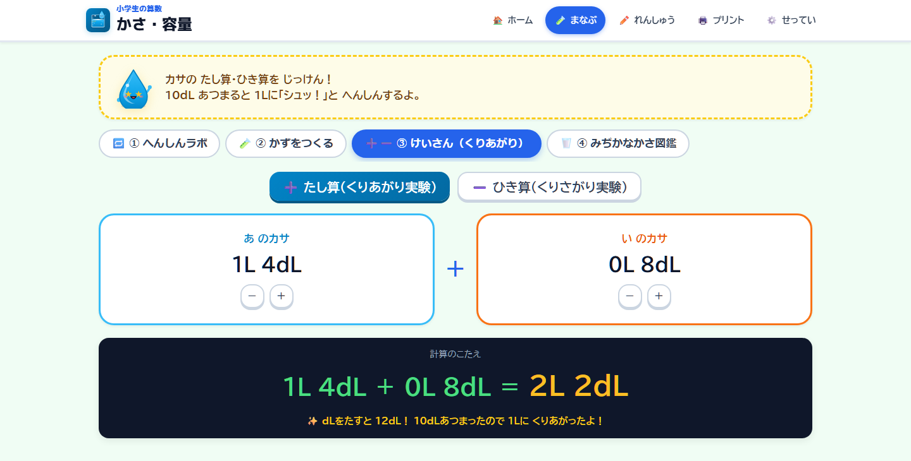
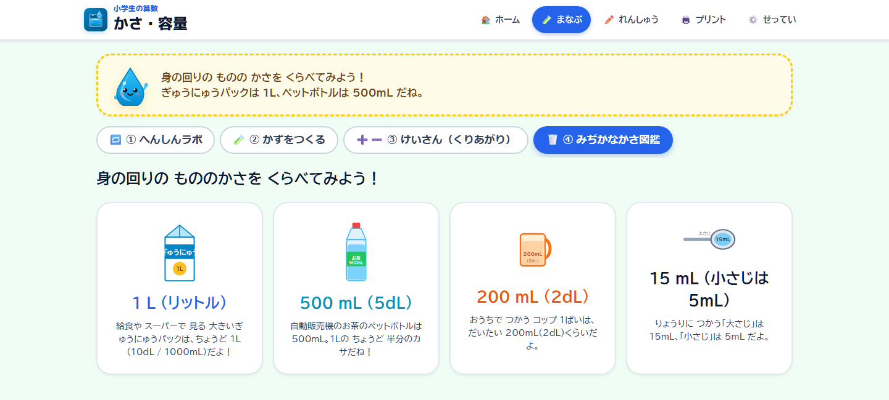
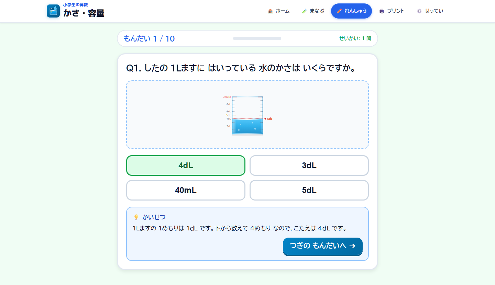
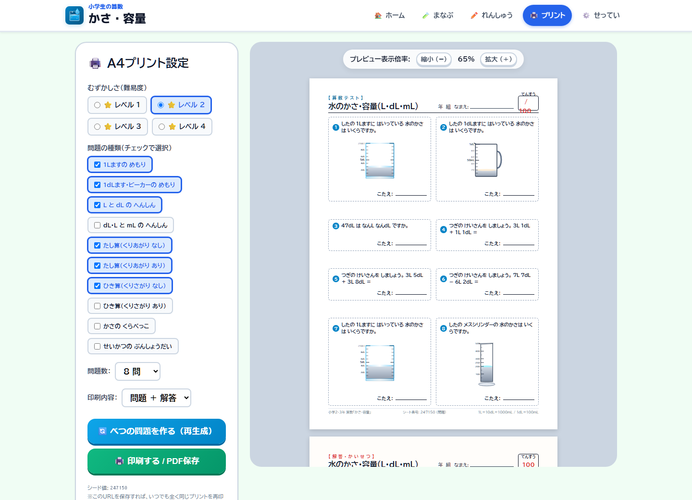
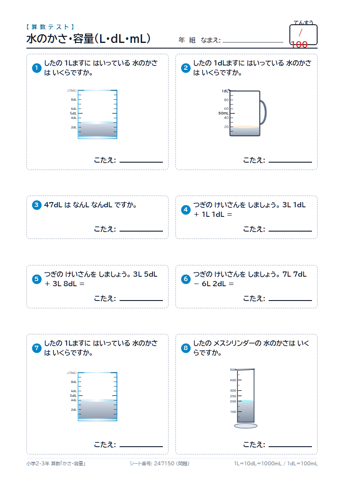
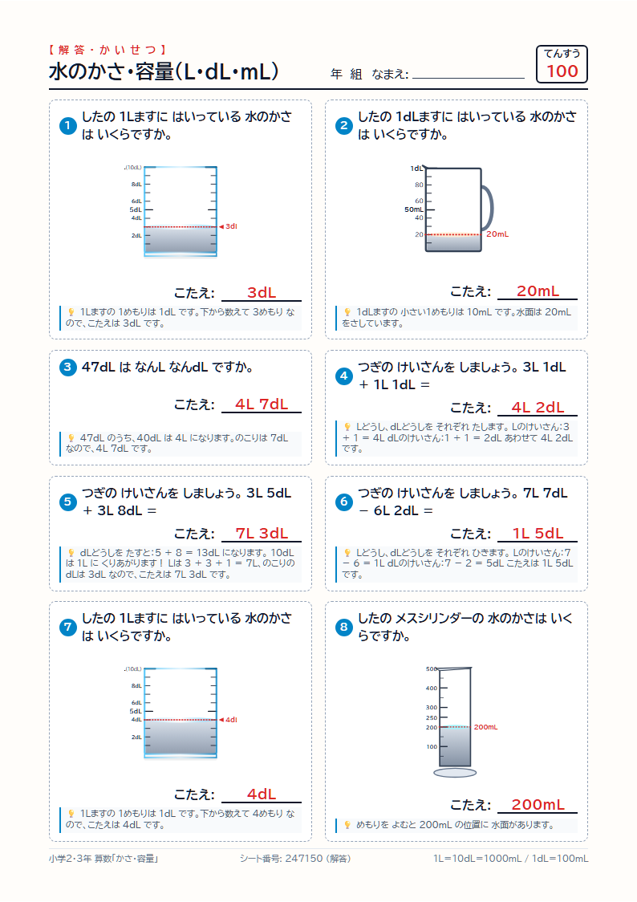
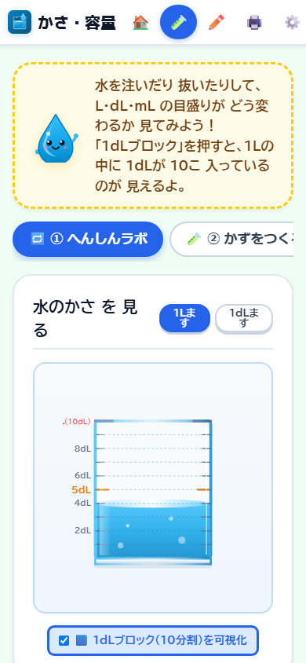
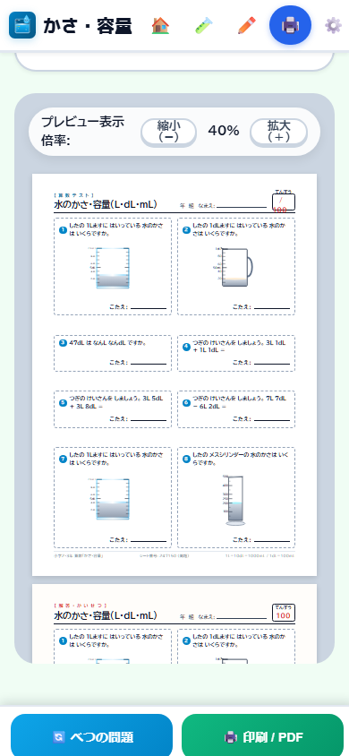

# 算数 かさ・容量（L・dL・mL）

小学2・3年生の「水のかさ」を、**画面でさわって理解し、そのままA4テストにして印刷できる**Webアプリです。

1Lますに水を注ぐ・抜くと、L・dL・mL の表示が同時に動きます。10dL たまると 1L に「くりあがる」ようすもその場で見られます。理解できたら、同じ画面から難易度を選んで **A4の問題用紙と解答シートを自動作成**。おうちでも教室でも、印刷ボタンひとつで配れます。

インストール不要・アカウント不要・サーバーへのデータ送信なし。**ビルド工程も外部ライブラリもありません。**



---

## 3つの使い方

| | できること |
|---|---|
| 🧪 **まなぶ** | 水を注ぐ・抜くシミュレーションで、L・dL・mL の関係を目で確かめる |
| ✏️ **れんしゅう** | 難易度☆1〜☆4の10問テスト。即時判定＋図つきのかいせつ |
| 🖨️ **プリント** | A4縦の問題用紙＋解答シートを自動生成。印刷・PDF保存 |

---

## 画面でまなぶ

### へんしんラボ — 「1Lの中に1dLが10こ」を目で見る

スライダーや「4dL」「1L（いっぱい）」ボタンで水量を変えると、`0.4 L` `4 dL` `400 mL` が同時に切り替わります。「1dLブロック(10分割)を可視化」をオンにすると、1Lますが10等分に区切られて見えます。



### けいさん — くりあがり・くりさがりの「じっけん」

`1L 4dL ＋ 0L 8dL` のように操作すると、dLが12dLになり、10dLが1Lへ「シュッ！」とくりあがるところまで説明が出ます。ひき算（くりさがり）も同じように試せます。



### みぢかなかさ図鑑 — 量の感覚を身につける

牛乳パック1L、ペットボトル500mL、コップ200mL、スプーン15mL。身の回りのものと結びつけて「だいたいどれくらい」をつかみます。



---

## れんしゅう（10問テスト）

難易度を選んで4択に挑戦。答えるとその場で判定され、めもりの読み方まで図と文で説明します。



---

## A4プリント作成

難易度・問題の種類・問題数（6/8/10問）・印刷内容（問題のみ／解答のみ／両方）を選ぶと、右側のプレビューがすぐ更新されます。「べつの問題を作る」を押すたびに新しい問題が並びます。



出力されるのはJIS A4縦（210mm × 297mm）の実寸レイアウト。なまえ・年組欄と点数欄つきの問題用紙と、赤字の答え＋1問ごとのかいせつが入った解答シートが同時に作られます。

| 問題用紙 | 解答シート |
|---|---|
|  |  |

### 同じプリントをいつでも再印刷できます

問題は**シード値つきのURL**で完全に再現されます。プリント画面のURL（例: `#print?d=2&n=8&out=both&seed=247150`）をブックマークしておけば、同じ紙が何度でも刷れます。「先週配ったテストをもう1枚」も、「同じ設定で別の問題を」も自由自在です。

---

## スマートフォン・タブレット対応

A4プレビューは画面幅に合わせて自動で縮小され、用紙1枚の全体像がそのまま確認できます。「べつの問題」「印刷 / PDF」は**常に画面下部に固定表示**されるので、設定やプレビューをどこまでスクロールしても上に戻る必要がありません。

| スマートフォンでまなぶ | スマートフォンでプリント |
|---|---|
|  |  |

---

## 1分で試す

必要なものは [Node.js](https://nodejs.org/) 20以上だけです。

```bash
git clone git@github.com:Satoshi-Hiramatsu/Volume-and-Capacity.git
cd Volume-and-Capacity
npm install
npm run serve
```

ブラウザで <http://localhost:8788> を開きます。終了するときは、起動したターミナルで `Ctrl+C` を押してください。

Cloudflare Workers の実行環境ごと再現したい場合は `npm run dev`（wrangler）を使います。

### 使いかた 3ステップ

1. 上のメニューから **まなぶ** を開き、水を動かして L・dL・mL の関係を確かめる
2. **れんしゅう** で難易度を選び、10問テストに挑戦する
3. **プリント** で難易度と問題数を選び、「印刷する / PDF保存」からA4に出力する

---

## 収録している問題パターン

10種類のパターンから、難易度に応じて自動的に組み合わせて出題します。

| ID | 問題の種類 | 内容 |
|---|---|---|
| P1 | 1Lますの めもり | 1Lますの水面を読む |
| P2 | 1dLます・ビーカーの めもり | 1dLます、ビーカー、メスシリンダーを読む |
| P3 | L と dL の へんしん | 1L＝10dL の単位換算 |
| P4 | dL・L と mL の へんしん | 1dL＝100mL、1L＝1000mL の単位換算 |
| P5 | たし算（くりあがり なし） | dLどうし・Lどうしのたし算 |
| P6 | たし算（くりあがり あり） | 10dL を 1L にくりあげる |
| P7 | ひき算（くりさがり なし） | dLどうし・Lどうしのひき算 |
| P8 | ひき算（くりさがり あり） | 1L を 10dL にくずす |
| P9 | かさの くらべっこ | 単位のちがう2つの量を比べる |
| P10 | せいかつの ぶんしょうだい | 実生活を題材にした文章題 |

### 難易度プリセット

| レベル | ねらい | 出題パターン |
|---|---|---|
| ⭐ 1：初級（やさしい） | ますのめもり、1L＝10dL、かんたんなたし算 | P1, P3, P5 |
| ⭐ 2：中級（標準） | 1dLます・ビーカー、LとdLのへんしん、くりあがりたし算、ひき算 | P1, P2, P3, P5, P6, P7 |
| ⭐ 3：上級（しっかり） | mLへのへんしん、くりさがりひき算、くらべっこ、文章題 | P1, P2, P3, P4, P6, P7, P8, P9, P10 |
| ⭐ 4：発展（マスター） | 全パターンから総合出題 | P1〜P10 |

---

## 子どもが読みやすいように

- **UDフォント**（BIZ UDPGothic）と大きめの文字サイズ
- **ひらがな・漢字の表示**を「小学2年（ひらがな中心）／小学3年（ならう漢字）／一般」から選択（せってい画面）
- **ふりがな（ルビ）** の表示切り替え、**効果音**のオン・オフ
- 指でも押しやすい大きめのタップターゲット（主要ボタンは52px以上）
- 容器のイラストはすべて手書きのSVG。ガラスの透明感、水面のメニスカス、正確な10分割目盛りを描き分けています

設定は端末のブラウザ内（localStorage）にだけ保存されます。サーバーには何も送信しません。

---

## 技術構成

| 項目 | 内容 |
|---|---|
| フロントエンド | Vanilla JavaScript（ES Modules）、ハッシュルーター、ビルド工程なし |
| 外部ライブラリ | なし（実行時の依存パッケージ0） |
| グラフィック | インラインSVGを動的生成（`public/lib/vessels-svg.js` ほか） |
| 問題生成 | シード付き擬似乱数による完全再現（`public/lib/rng.js`） |
| 配信 | Cloudflare Workers + Static Assets（`src/worker.js`） |
| PWA | `manifest.webmanifest` / `sw.js`（HTTPS配信時にService Workerを登録し、主要な画面資産をキャッシュ） |
| 開発ツール | wrangler（devDependency のみ） |

```
public/
├── index.html          画面の骨組みとトップバー
├── app.js              ハッシュルーター
├── screens/            home / learn / practice / print / settings
├── lib/
│   ├── problems/       P1〜P10 の問題ジェネレーター
│   ├── vessels-svg.js  容器・水面のSVG描画
│   ├── character-svg.js マスコット「ドロップくん」
│   ├── rng.js          シード付き乱数
│   └── storage.js      設定の保存（localStorage）
├── style.css / tokens.css / print.css
└── sw.js               Service Worker
```

---

## デプロイ

`main` ブランチへ push すると、GitHub Actions（[.github/workflows/deploy.yml](.github/workflows/deploy.yml)）が Cloudflare Workers へ自動デプロイします。リポジトリシークレット `CLOUDFLARE_API_TOKEN` と `CLOUDFLARE_ACCOUNT_ID` が必要です。

手動でデプロイする場合:

```bash
npm run deploy
```

公開先は [wrangler.jsonc](wrangler.jsonc) で `volume-and-capacity.molkz.com` をカスタムドメインとして設定しています。

設定を変更せずに内容だけ検証したいときは、次のコマンドでビルド内容を確認できます。

```bash
npx wrangler deploy --dry-run
```

---

## スクリーンショットの更新

このREADMEの画像は、`npm run serve` で起動したローカルサーバーに対してヘッドレスブラウザで撮影しています。撮影対象・URL・ビューポート・操作手順は [.github/readme-showcase.json](.github/readme-showcase.json) に記録してあり、UIを変更したときは同じ条件で撮り直せます。A4シートの画像は印刷メディアをエミュレートして等倍（794×1123px＝A4相当）で切り出しています。

---

## ライセンス

ISC（[package.json](package.json)）
